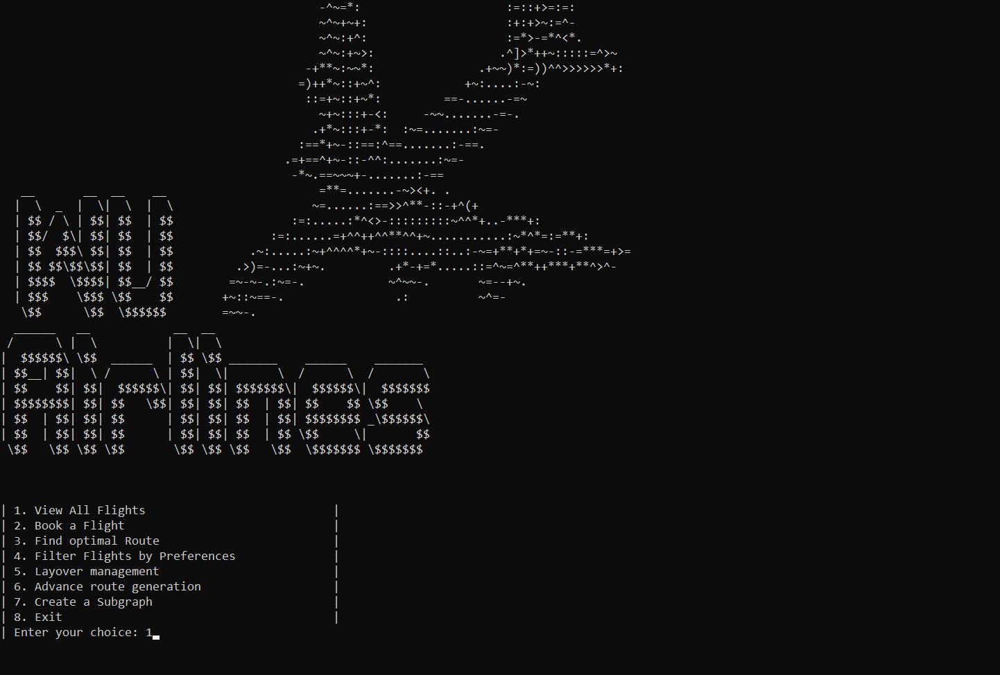
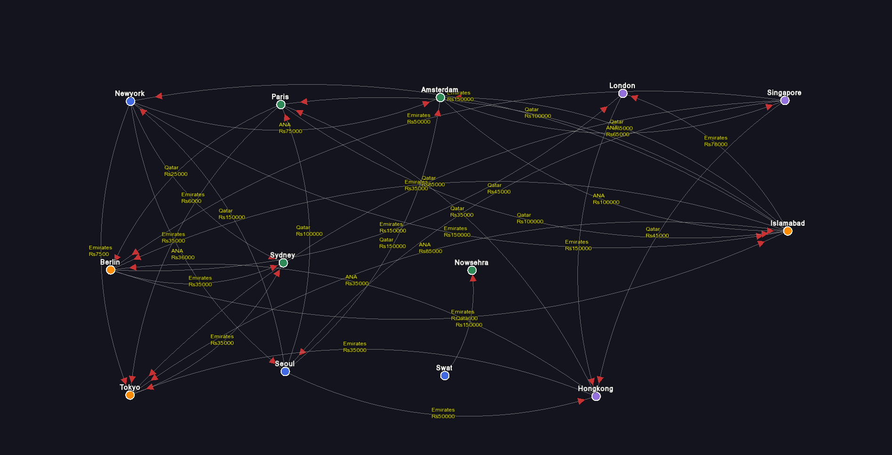
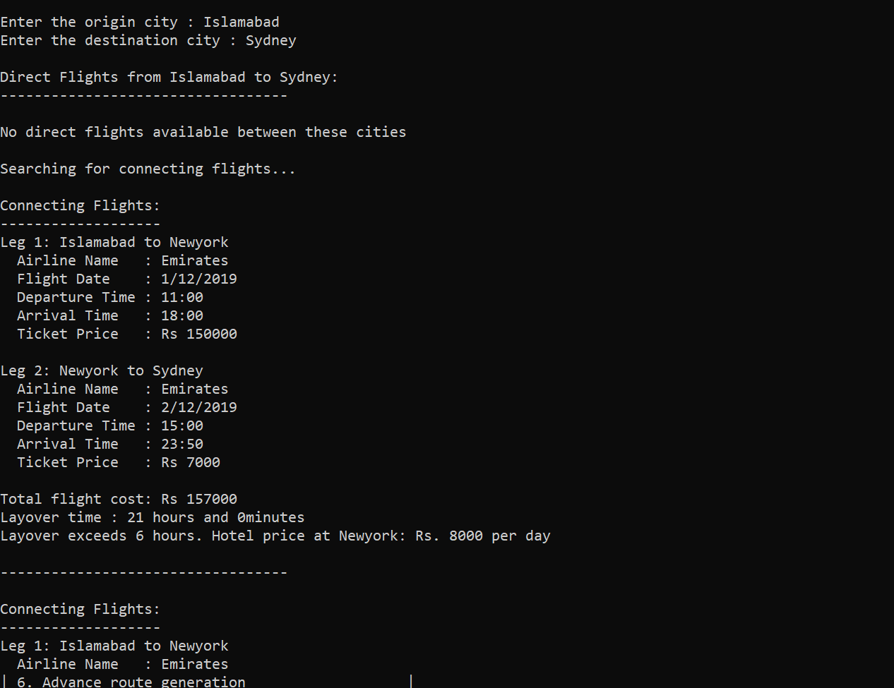
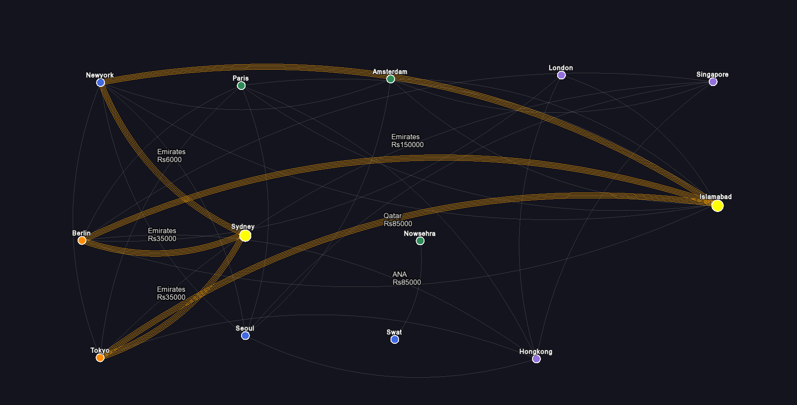

# SkyNav AI – Flight Path Visualizer

SkyNav AI is a dynamic, visually interactive flight path management and booking system developed in C++ with custom data structures and SFML graphics. It helps users explore flight routes, manage bookings, calculate layovers, and find optimized flight paths using real flight data.

This project was developed as a semester project for **Data Structures** (CS2001) at **FAST NUCES Islamabad**.

---

## Features

### Flight Data Graph
- Cities are represented as **vertices**, and flights between them as **edges**
- Each edge stores: airline, duration, price, flight & landing time, and date
- Flight data is read from `Flights.txt`
- Visualized using SFML with edges color-coded by flight duration

### Flight Booking System
- Allows booking from source to destination on a specific date
- Displays all direct and connecting flights with layover feasibility
- Routes are visually highlighted in the graph

### Shortest & Cheapest Route Finder
- Uses **Dijkstra’s** algorithms with a custom **priority queue (heap)**
- Calculates shortest or cheapest path considering all layover rules
- Real-time visual animation of pathfinding algorithms in action

### Custom Routes & Preferences
- Users can apply preferences (e.g., preferred airlines, transit cities)
- Filters and displays only the relevant flights accordingly
- Preferred routes are visualized uniquely in the graph

### Layover Management (Queue)
- All layovers managed using custom **queue**
- System ensures enough time between connecting flights
- Layover info visualized with dashed lines and tooltips

### Advanced Route Handling (Linked List)
- Multi-stop journeys are stored and managed using a **linked list**
- Each node represents a leg of the trip and adapts dynamically
- Allows real-time addition/removal of journey segments

### Subgraph Visualization
- Users can generate subgraphs (e.g., only Qatar Airways flights)
- Non-relevant cities dimmed; only relevant edges are visible
- Makes it easier to explore specific airlines or transit preferences

### Visual Pathfinding
- Dijkstra’s shown with live node evaluation animations
- Bidirectional search supported for large network efficiency
- Glowing effect highlights final path

---

## Data Files

- `Flights.txt`: Contains origin, destination, travel date, flying/landing time, price, airline
- `HotelCharges_perday.txt`: Contains per-day hotel charges for each city (used in case of long layovers)

---

## Data Structures Used

| Feature | Structure |
|--------|-----------|
| Flight network | Graph (adjacency list) |
| Pathfinding | Min-Heap (custom priority queue) |
| Layover Handling | Queue |
| Route Segments | Linked List |
| Subgraphs | Filtered graph copies |
| Preferences | Filter & traversal logic |

---

## Screenshots

### Main Menu

### Main Flight Graph (Graphical)

### Booking – Detailed Menu

### Booking – Route Graph (Graphical)

---

## How to Compile & Run

- Compile using any C++ compiler that supports SFML
- Run directly from `main.cpp`
- Ensure that `Flights.txt` and `HotelCharges_perday.txt` are placed correctly in the working directory
- Make sure you have properly did the SFML setup in you compiler, otherwise it will gives SFML error.
---

## Contact

If you face any issues running the project or have questions:

**Email:** wassem.sajjad.cybersec@gmail.com

---

## University & Course Information

- **Institution:** FAST NUCES Islamabad  
- **Department:** Cyber Security 
- **Course:** CS2001 – Data Structures  
- **Instructor:** Mam. Sadia Saad 
- **Project Title:** SkyNav AI – Flight Path Visualizer 

---

## Show your Support

Please ⭐️ this repository if this project helped you!
